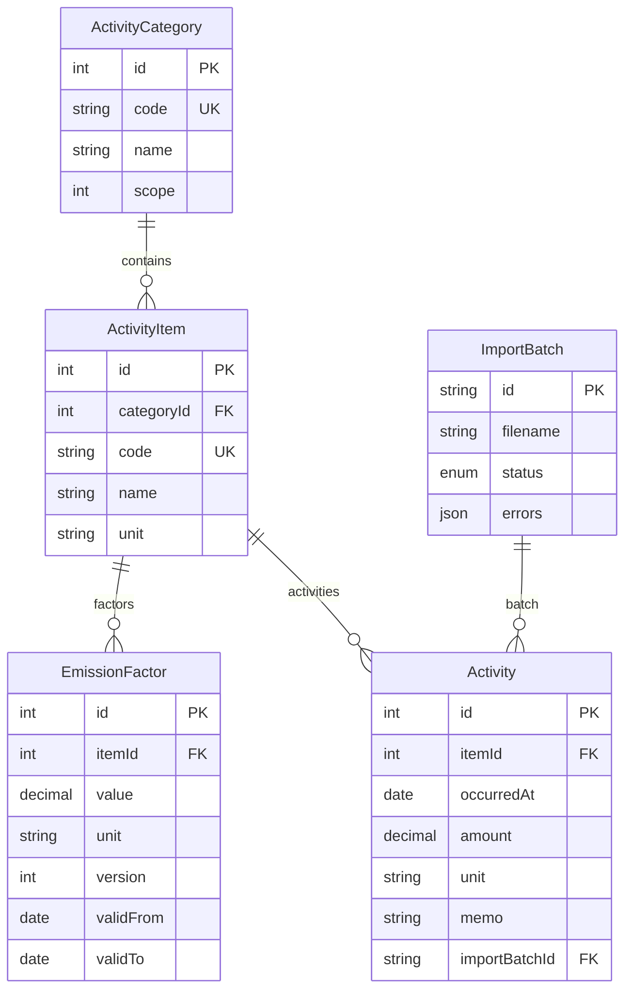

# PCF Dashboard

제품별 탄소 발자국(Product Carbon Footprint, PCF)을 측정·집계·시각화하는 인터랙티브 대시보드입니다. 채용 과제용 저장소이며, **커밋 히스토리**로 작업 과정을 함께 남깁니다.

## 과제 체크리스트 대응 (자가 점검)

| 구분 | 체크 항목 | 이 저장소에서의 근거 |
|------|-----------|----------------------|
| **필수** | PCF 계산 결과 시각화·직관 | 대시보드 KPI·월별/카테고리/품목 차트·활동 원장(PCF) 표. 단위는 `formatCo2e` 등으로 표기. |
| **필수** | 표시 값·단위 정확 | `Decimal` 기반 `calculateEmission`, 단위 불일치 시 `UnitMismatchError`. 차트 툴팁·KPI에 kgCO2e/tCO2e. |
| **필수** | 잘못된 입력 시 에러 | 활동 입력: Zod + RHF 필드 에러, API `ApiError` 매핑. 임포트: 실패 행 목록 UI + **오류 CSV 다운로드**(`import/page.tsx`). |
| **필수** | UI 실행 영상·스크린샷 | 아래 **「스크린샷·영상 (GitHub 직접 업로드)」** 섹션에 캡처 이미지/GIF URL과 영상 링크를 첨부. |
| **필수** | README 로컬 실행 **5단계** + **`yarn start` 무오류** | 아래 **「로컬 실행 (과제 필수: 5단계 + yarn start)」** 참고. |
| **필수** | AI 사용 내역 README 기록 | 아래 **「AI 사용 내역」** 섹션. |
| **필수** | 시스템 설명·설계 README | 아래 **「시스템 개요」**, **「설계 결정 / Trade-off」**, **ERD**. |
| **필수** | GitHub 공개·커밋 이력 | 저장소를 **Public** 으로 설정하고, 제출 전 `git log` 로 히스토리 확인. |
| **권장** | README에 ERD/스키마 | Mermaid ERD 아래 참고. |
| **권장** | 설계 이유 2점 이상·Trade-off | 설계 섹션에 **왜 이렇게 나눴는지** 2점 이상 + 트레이드오프 명시. |
| **보너스** | Docker Compose 즉시 실행 | `docker-compose.yml` + `yarn db:up`. |
| **보너스** | 과제 Excel 그대로 임포트 | `/import` + `POST /api/v1/import`, 파서 `src/lib/excel-parser.ts`. |
| **보너스** | OpenAPI/Swagger | `/docs`, `GET /api/v1/openapi`. |

### 스크린샷·영상

- 대시보드 (`/`): KPI + 차트 + 활동 원장 + 임포트 (`/import`): 업로드 결과 + 실패 CSV 다운로드


- 활동 입력 (`/activities/new`): 정상 입력 + 오류 메시지


- 배출계수 (`/factors`): 버전 목록 + 최근 변경


---

## 기술 스택

- **Framework**: Next.js 16 (App Router) + TypeScript
- **DB / ORM**: PostgreSQL 16 + Prisma 6
- **UI**: Tailwind CSS v4 + shadcn/ui (Base UI / Nova preset)
- **Validation**: Zod
- **Chart**: Recharts
- **Excel Import**: SheetJS (`xlsx`)
- **API Docs**: OpenAPI 3.0 (`/api/v1/openapi`) + Swagger UI (`/docs`)
- **Test**: Vitest

---

## 로컬 실행 (과제 필수: 5단계 + `yarn start`)

```bash
# 1) 저장소 클론 + Node 버전 (저장소 루트의 .nvmrc 기준, 예: Node 24)
git clone https://github.com/limshyun/pcf-dashboard.git && cd pcf-dashboard && nvm use

# 2) 환경 변수 + 패키지 설치
cp .env.example .env && yarn install

# 3) PostgreSQL 기동 + 스키마 적용 + 시드 (Docker Compose)
yarn db:up && yarn db:deploy && yarn db:seed

# 4) 프로덕션 빌드
yarn build

# 5) 프로덕션 서버 (과제 검증용)
yarn start
```

브라우저에서 **http://localhost:3000** 접속.

- **개발 시**에는 위 3) 이후 `yarn dev` 로 핫 리로드할 수 있습니다.
- `yarn db:migrate` 는 로컬에서 스키마를 바꿀 때(`migrate dev`) 쓰고, **처음 클론 후 `yarn start` 검증**에는 **`yarn db:deploy`** 가 CI/운영과 동일하게 맞습니다.
- `.env` 의 `DATABASE_URL` 은 `.env.example` 과 같이 Docker DB(`pcf:pcf@localhost:5432/pcf`)를 가리켜야 합니다.

### API 문서 (Swagger)

1. 서버 실행 후 **http://localhost:3000/docs**
2. 원시 스펙: **http://localhost:3000/api/v1/openapi**
3. 스펙 소스: `src/lib/openapi-spec.ts`

### 활동 데이터(Excel) 적재

1. 위 절차로 앱 실행.
2. **http://localhost:3000/import** → 과제 제공 `.xlsx` 선택 → 업로드.
3. 시트명은 `과제용 데이터` 등 자동 탐지(`excel-parser`), 컬럼은 **`일자(원본) / 활동 유형 / 설명 / 활동량(헤더 「량」또는「양」) / 단위`** — 둘 다 파서에서 인식합니다.
4. 업로드 결과·히스토리 표시, 실패 행은 CSV로 내려받기 가능.
5. **http://localhost:3000** 대시보드에서 반영 확인.

> 시드로 함께 넣으려면 `prisma/seed-data/activity-data.xlsx` 를 두고 `yarn db:seed` (해당 파일은 `.gitignore` 될 수 있음).

### 테스트

```bash
yarn test   # Vitest — PCF 계산·집계 단위 테스트 (domain/__tests__)
```

## Assumptions

- 과제 제공 데이터 기준으로 활동 품목은 `KEPCO`, `PLASTIC_1`, `PLASTIC_2`, `TRUCK` 중심으로 구성했습니다.
- 배출계수 매칭 규칙은 `validFrom <= occurredAt < validTo` 이며, `validTo` 가 `null` 인 경우 현재 유효로 간주합니다.
- 활동 입력 단위는 품목 기준 단위와 일치해야 하며, 불일치 시 저장 대신 오류를 반환합니다.

---

## 시스템 개요 (평가: 도메인 이해 · 설계)

### PCF · GHG Scope

- **PCF(제품 탄소 발자국)**: 활동량(예: kWh, kg) × **품목·시점에 유효한 배출계수**(예: kgCO2e/kWh)로 활동별 **kgCO2e**를 구하고, 이를 월·카테고리·품목·Scope로 집계합니다.
- **GHG Scope**: `ActivityCategory.scope` (1/2/3)를 KPI·원장에 노출. 전기(예: Scope 2)·원소재·운송(예: Scope 3) 등 **과제 시나리오와 맞는 분류**를 시드 데이터로 고정합니다.

### 아키텍처 요약

| 레이어 | 역할 |
|--------|------|
| `domain/` | DB 없이 동작하는 계산·집계 (`pcf-calculator`, `pcf-aggregator`), 단위·시점 매칭. |
| `services/` | Prisma + Zod 입력, 유스케이스(API 라우트가 호출). |
| `app/api/v1/` | REST + JSON 래핑 `{ data, meta? }` / `{ error }`. |
| `app/` (페이지) | 클라이언트 컴포넌트, `api-client` 로 API 호출. |

### 입력 검증 · 에러 UX

- **폼**: React Hook Form + Zod (필수 필드, 날짜 형식, 양수 등).
- **API**: 서비스에서 `UnknownItemError`, `UnitMismatchError` 등 → `api-response.ts` 가 HTTP 코드·메시지로 변환 → 클라이언트에서 필드/토스트 형태로 표시.

---

## 프로젝트 구조

```
src/
  app/                  Next.js App Router
    api/v1/             REST + openapi
    docs/               Swagger UI
    activities/new/     활동 입력 + 최근 목록
    factors/            배출계수 버전 + 최근 변경
    import/             Excel 임포트
  components/           UI·대시보드·레이아웃
  domain/               PCF 계산·집계 (순수 로직)
  services/             Prisma 유스케이스
  hooks/                데이터 페칭 훅
  lib/                  api-client, openapi-spec, excel-parser, format …
prisma/
  schema.prisma
  migrations/
  seed.ts
```

## AI 사용 내역

과제 정책: **AI 사용 가능** — 다만 **생성된 코드를 설명**할 수 있고, **프롬프트·의사결정**을 말할 수 있어야 합니다.

본 프로젝트에서는 **AI를 “대리 작성자”가 아니라 보조 도구(Cursor 등)”로만** 썼습니다. 초안·보일러플레이트·리팩터 제안은 AI에 맡기되, **스키마·도메인 규칙·API 형태·UX 문구**는 지원자가 정하고, **동작 확인·엣지 케이스·과제 체크리스트 대응**은 지원자가 직접 검증·수정했습니다.

| 단계 | AI 활용 (보조) | 본인 역할 (설계·검증·수정·이해) |
|------|------------------|----------------------------------|
| 부트스트랩 | Next/Prisma/Docker 초안 생성 | `.env`·포트·마이그레이션 흐름 확인, 스키마 필드·관계 확정, `yarn start` 경로 정리 |
| 도메인/API | PCF 계산·집계·Vitest·라우트 초안 | `pickFactorAt`·단위 검증 의미 검토, `ApiError` 매핑·HTTP 코드 정책 확정, 실패 시나리오 수동 테스트 |
| UI | 페이지·차트·폼 레이아웃 초안 | 라벨·에러 메시지 한글화, 임포트/대시보드 플로우 점검, 필요 시 컴포넌트 구조 조정 |
| 리팩터·기능 확장 | 네이밍·활동 원장·삭제 API 등 제안 | diff 리뷰 후 채택 여부 결정, lint/test 통과 확인 |
| 문서·스펙 | OpenAPI/README/ERD 초안 | 과제 체크리스트와 맞춰 재구성 |

---

## ERD (요약)



---

## 설계 결정 / Trade-off (발표용: **왜?** + **트레이드오프**)

### 왜 마스터(품목)·거래(활동)·계수(버전)를 나눴나?

- **이유**: 엑셀의 “항목”과 활동 기록이 **같은 품목 코드**로 묶여야 계수 시계열을 재사용할 수 있음. 문자열로만 저장하면 오타·개명 시 계산이 깨짐.
- **트레이드오프**: 조인·시드 비용은 늘지만, 데이터 정합성과 감사 가능성이 좋아짐.

### 왜 PCF(kgCO2e)를 활동 행에 저장하지 않았나?

- **이유**: 배출계수가 바뀌어도 **과거 활동량**은 그대로 두고, **그날짜에 유효했던 계수**로 다시 곱할 수 있어야 함.
- **트레이드오프**: 조회·대시보드 시 CPU 비용 증가. 대응: 캐시·배치 사전 계산은 범위 밖.

### 왜 대시보드가 같은 `computeAll` 을 여러 API에서 반복 호출하나?

- **이유**: 구현 단순·데이터 소스 단일(한 번의 DB 읽기 패턴).
- **트레이드오프**: 요청당 Prisma/계산 중복. 확장 시 단일 집계 API 또는 서버 캐시로 묶을 수 있음.

