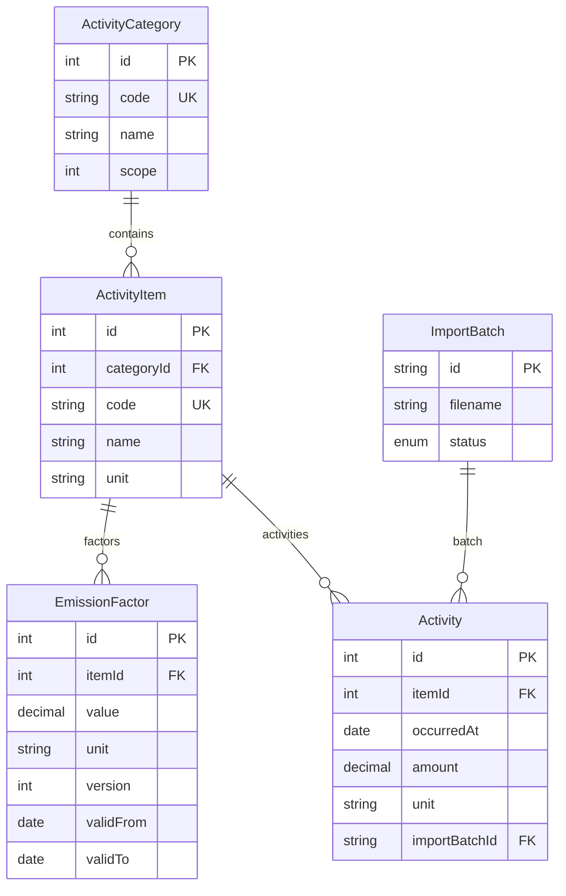

# PCF Dashboard

제품별 탄소 발자국(Product Carbon Footprint, PCF)을 측정·집계·시각화하는 인터랙티브 대시보드입니다. 채용 과제로 진행 중이며, 단계별 커밋 히스토리로 작업 과정을 함께 남깁니다.

## 기술 스택

- **Framework**: Next.js 16 (App Router) + TypeScript
- **DB / ORM**: PostgreSQL 16 + Prisma 6
- **UI**: Tailwind CSS v4 + shadcn/ui (Base UI / Nova preset)
- **Validation**: Zod
- **Chart**: Recharts
- **Excel Import**: SheetJS (`xlsx`)
- **API Docs**: OpenAPI 3.0 (`/api/v1/openapi`) + Swagger UI (`/docs`)
- **Test**: Vitest

## 로컬 실행 방법 (5단계)

```bash
# 1) 저장소 클론 + Node 24
git clone <repo-url> && cd hanaloop-recruitment-pcf-dashboard
nvm use            # .nvmrc 기준 Node 24

# 2) 환경 변수 + 의존성
cp .env.example .env
yarn install

# 3) PostgreSQL 기동 + 마이그레이션
yarn db:up                            # docker compose up -d
yarn db:migrate                       # init 마이그레이션 적용

# 4) 마스터 데이터 시드 (카테고리 / 품목 / 배출계수 v1)
yarn db:seed

# 5) 개발 서버
yarn dev                              # http://localhost:3000
```

### API 문서 (Swagger)

1. `yarn dev` 실행 후 브라우저에서 **http://localhost:3000/docs** 를 연다.
2. 원시 스펙은 **http://localhost:3000/api/v1/openapi** (JSON).
3. 스펙 소스는 `src/lib/openapi-spec.ts` 에서 유지보수한다.

### 활동 데이터(Excel) 적재

활동 데이터는 **앱 화면에서 직접 업로드**하는 것을 권장합니다. 시드 단계에 별도 파일 준비가 필요 없습니다.

1. 위 5단계로 앱을 띄운다.
2. http://localhost:3000/import 접속 → 과제 제공 `.xlsx` 파일 선택 → **업로드**.
3. 시트(`과제용 데이터`)와 컬럼(`일자(원본) / 활동 유형 / 설명 / 량 / 단위`)이 자동 매칭되어 적재되며, 결과(성공/실패 건수, 실패 행 CSV 다운로드)가 화면에 표시됩니다.
4. 적재 후 http://localhost:3000 대시보드에서 즉시 확인할 수 있습니다.

> CLI로 시드와 함께 적재하고 싶다면 `prisma/seed-data/activity-data.xlsx` 위치에 파일을 두고 `yarn db:seed`를 실행하세요. (해당 경로의 `.xlsx`는 회사 내부 자료 보호를 위해 `.gitignore` 처리되어 저장소에 포함되지 않습니다.)

## 프로젝트 구조

```
src/
  app/                  Next.js App Router (페이지 + /api/v1 라우트)
    api/v1/             REST API + `openapi` (스펙 JSON)
    docs/               Swagger UI (`/docs`)
    activities/new/     활동 입력 폼
    factors/            배출계수 버전 관리
    import/             Excel 임포트
  components/
    ui/                 shadcn/ui (Base UI) 프리미티브 + ChartCard / KpiCard / FormField
    dashboard/          KPI 카드, 월별/카테고리/품목 차트, 기간 필터
    factors/            배출계수 추가 다이얼로그
    layout/             SiteHeader (글로벌 네비게이션)
  domain/               순수 도메인 로직 (PCF 계산, Scope 매핑, 단위 검증, 도메인 에러)
  services/             유스케이스 계층 (Prisma 호출 + Zod 입력 스키마)
  hooks/                useDashboard, useItems, useFactors, useImportBatches
  lib/                  api-client, api-response, openapi-spec, excel-parser, format, prisma 등
prisma/
  schema.prisma         ActivityCategory / ActivityItem / EmissionFactor / Activity / ImportBatch
  migrations/           init 마이그레이션
  seed.ts               마스터 + (선택) 활동 데이터 시드
```

## 진행 상황

- [x] Step 1. Next.js 16 + TS + Tailwind + shadcn/ui 부트스트랩
- [x] Step 2. Prisma 스키마 + Docker Compose
- [x] Step 3. 시드 데이터 로드 (마스터 + Excel 활동 데이터)
- [x] Step 4. PCF 계산 도메인 로직 + Vitest 21건
- [x] Step 5. API Routes (`/api/v1`) 구현
- [x] Step 6. 대시보드 UI (KPI 4 + 월별/카테고리/품목 차트 + 기간 필터)
- [x] Step 7. 활동 입력 폼 + 배출계수 버전 관리 화면 (RHF + Zod, 다이얼로그)
- [x] Step 8. Excel 임포트 (`/import` 페이지 + `POST/GET /api/v1/import` + 실패 행 CSV 다운로드)
- [x] Step 9. Swagger 문서 (`/docs` + `GET /api/v1/openapi`)
- [x] Step 10. README 보강 + ERD (영상/스크린샷은 로컬 캡처 후 `docs/` 등에 추가 가능)
- [x] Step 11. 발표용 메모 정리 (아래 섹션)

## AI 사용 내역

> 채용 과제 정책에 따라 AI를 어떻게 사용했는지 단계별로 기록합니다. 발표 시 함께 설명할 예정입니다.

- (작성 예정) 사용한 도구, 주요 Prompt, 의사결정 근거를 단계별로 기록.

## ERD (요약)



## 설계 결정 / Trade-off

- **단일 Next.js 앱**: 과제 범위에 맞게 BFF 겸용 `app/api/v1` 로 동일 레포에서 UI·API를 제공한다. 운영 확장 시 API만 분리하기 쉽다.
- **배출계수 버전 테이블**: 활동 raw(`activities`)는 보존하고, `emission_factors`의 `validFrom`/`validTo`/`version`으로 **발생일 기준 계수**를 재현한다.
- **PCF 저장 비저장**: 집계·원장 표는 조회 시 `calculateEmission`으로 계산해, 계수가 바뀌어도 과거 활동량과 일관되게 재계산할 수 있다.
- **대시보드 API 병렬 호출**: 동일 DB 스냅샷 기준으로 네 엔드포인트를 `Promise.all`로 부르는 단순함을 택했고, 부하는 `computeAll` 중복과 트레이드오프한다.

## 발표용 메모 (요약)

1. **문제**: 엑셀 활동·배출계수를 DB로 옮기고, 기간·Scope·품목 관점에서 PCF를 보여준다.
2. **모델**: 카테고리 → 품목(단위) → 활동 / 품목 → 배출계수(시간 버전). 임포트 배치로 추적.
3. **도메인**: 단위·시점 매칭·Decimal 곱셈을 Prisma와 분리한 순수 함수 + Vitest.
4. **API/UI**: REST `/api/v1`, 대시보드·입력·계수·임포트·**OpenAPI 문서(`/docs`)**.
5. **한계·다음**: 캐시·단일 `computeAll` 묶음, 실운영 인증/권한은 범위 외.
